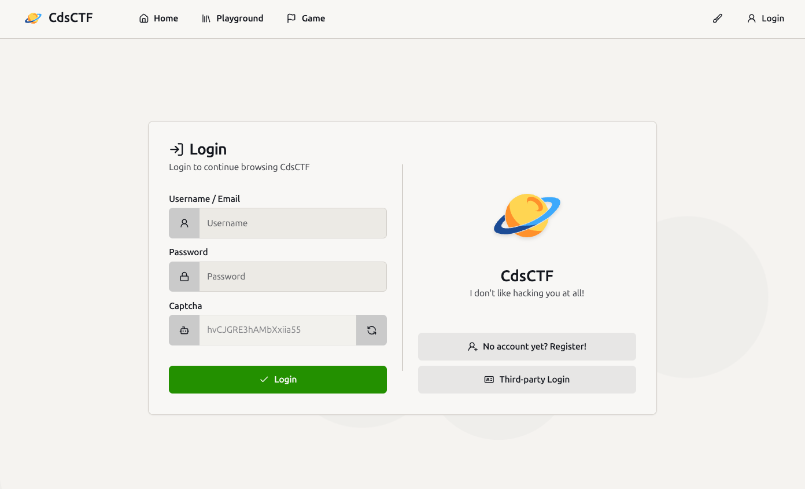
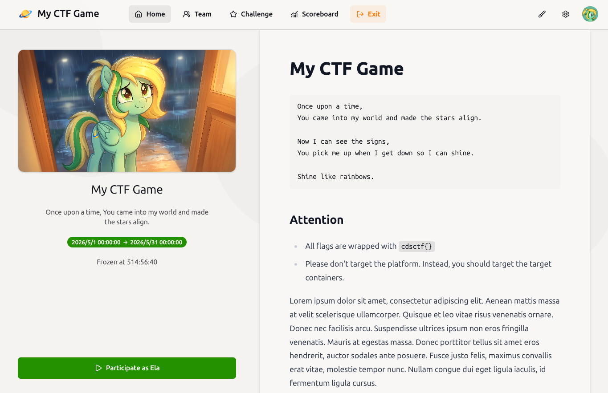
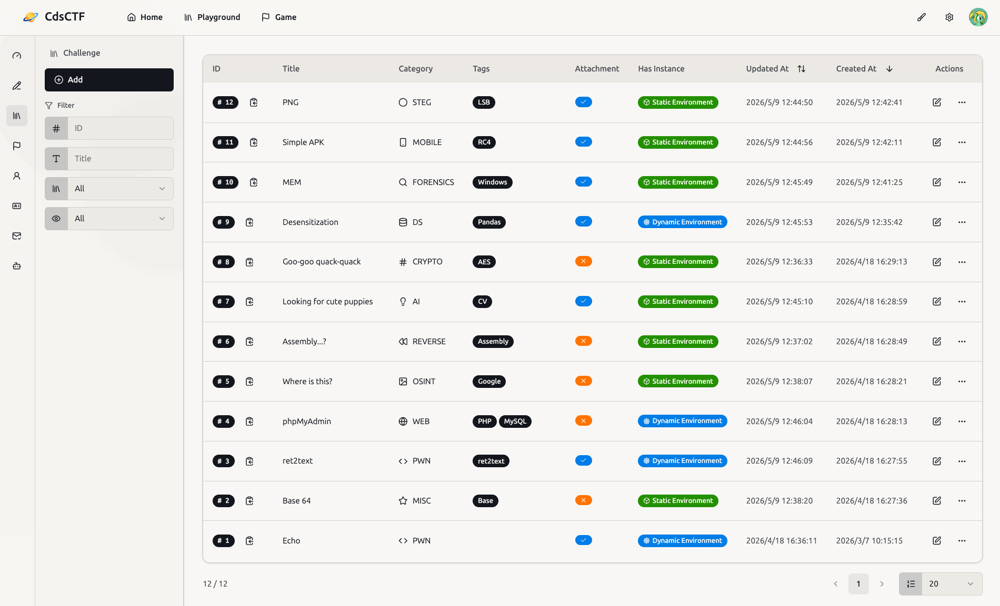

# CdsCTF

The **CdsCTF** project is an _innovative and high-performance_ CTF platform. Originally developed by [ElaBosak233 (Ela)](https://github.com/ElaBosak233), and continuously maintained by the community.

If you want to know how to deploy and how to use it, please refer to the [Documentation](https://cdsctf.e23.dev). If you want to contribute in various forms, please refer to [Contributing](./.github/CONTRIBUTING.md) and [Code of Conduct](./.github/CODE_OF_CONDUCT.md) first.

## Screenshots

## Acknowledgements

### Contributors

Thanks to everyone who has contributed to the project! Without you, CdsCTF would not be what it is today.

### Stars

## License

This project is licensed under the [GNU Affero General Public License v3.0](./LICENSE).